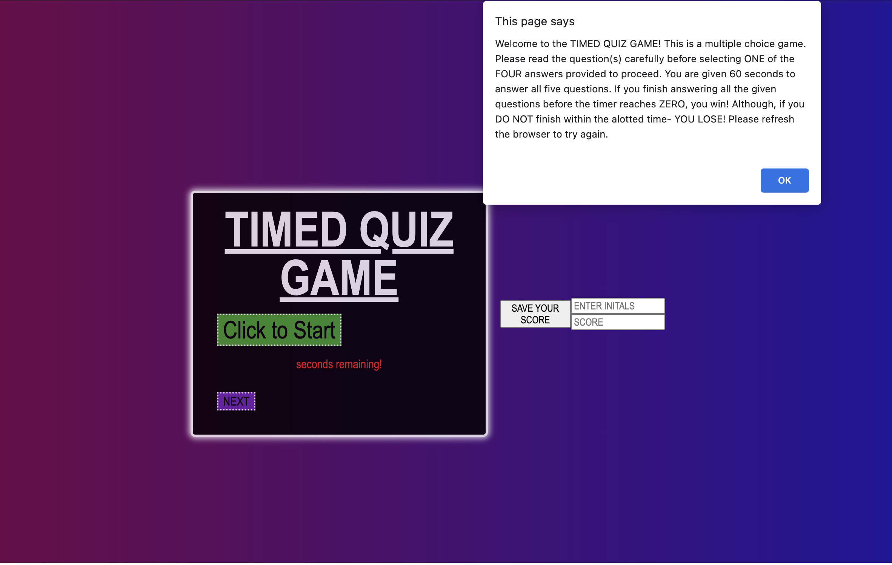

## Welcome to the Javascript Quiz Game

```
When entering this deployed application to play this trivia game, 
users will first be greeted with a prompt briefing the user with rules.
After reading the rules, the user will then select 'OK' after understand the rules and click the big green button to begin!

At the time of clicking the start button, there is a timer that appears on screen. Starting at 60 seconds, and counting down to answer the given questions. After making one of the four selections, the user will be notified if their choice was correct or incorrect.

The user will then proceed to move forward with the next button until the either complete all the questions in the 60 seconds provided and win, or they are unable to answer all the questions and lose. There is a form at the end that also allows the user to log their initials and score to save!
```

## 


[Click this link to test your JavaScript knowledge!](https://jadehuynh.github.io/timed-game/) 